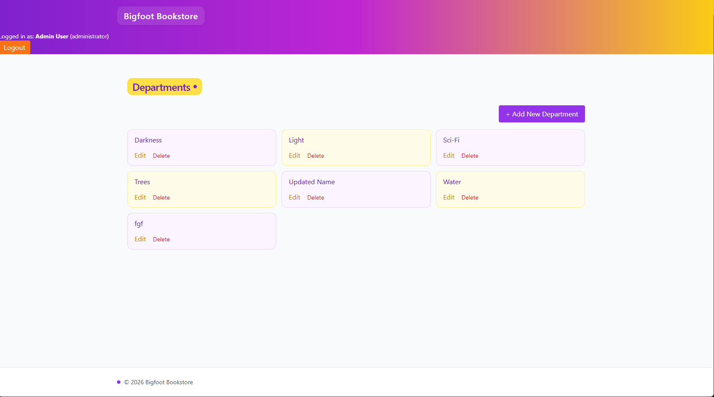
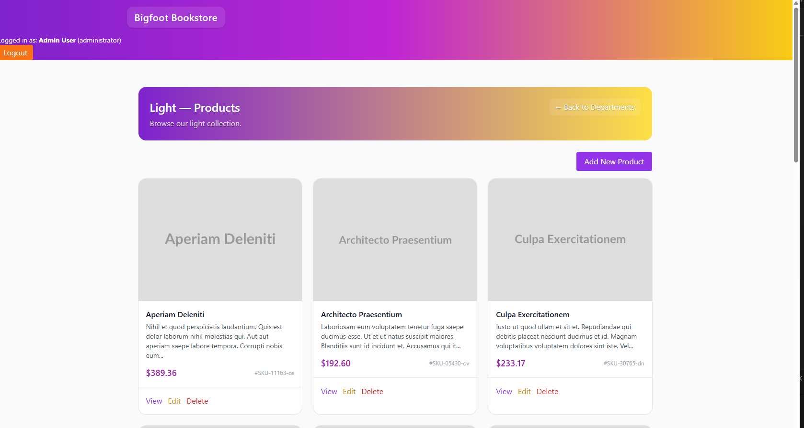

# Laravel Department & Product Manager

Simple Laravel app for managing departments and their products.

Built this to practice CRUD, nested routes, and basic auth/authorization.

## Preview

### Departments


### Products


## Features

- View all departments
- View products within a department
- Create, edit, and delete products
- Create, edit, and delete departments
- Nested routes (Departments → Products)
- Authentication (login required for changes)
- Authorization using Laravel policies

## Tech Used

- Laravel
- PHP
- Blade
- SQLite
- Tailwind CSS (basic styling)

## Setup

Clone the repo and run:

```bash
composer install
npm install
cp .env.example .env
php artisan key:generate
php artisan migrate --seed
npm run dev
php artisan serve
